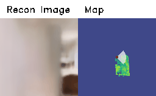

## Mapping

You can try mapping with pretrained models using demo notebooks.

### [Mapping using sample data](../%[Demo]%20Mapping%20using%20sample%20data.ipynb)
In this notebok, you can build an RNR-Map using sample trajectory data.
The trajectory data contains robot poses and corresponding RGBD images.

You can embed the images and also render the embedded images simultaneously.
You will see the visualization window during embedding phase.

Note that the image reconstruction is just for visualization.
You can skip the rendering part (embedder.generate) for faster embedding.

The speed of embedding and rendering depends on hardware settings.
In ours (Intel i7-9700KF CPU @ 3.60GHz, single RTX 2080 Ti), a single embedding process spends 10.9ms 
and the rendering process spends 68.0ms in average.
Note that the visualization also takes some time.

After embedding, you can freely navigate around inside the RNR-Map using the keyboard.
You can observe that RNR-Map can render the images from the novel-view, where the camera has not visited.
The visualization window will show the rendered images from RNR_map given a camera pose, as well as the location in RNR-Map.
Press 'w,a,s,d' to move the camera, and 'q' to quit navigation.

### [Mapping Using Simulator](../%[Demo]%20Mapping%20Using%20Simulator.ipynb)
You can also build RNR-map from directly from habitat simulator.
First, generate random navigation trajectory using habitat-simulator.
While collecting the trajectory, you can build RNR-Map simulataneously.
The visualization window will show the collected images and the rendered images from RNR-Map.

Also, note that the image reconstruction is just for visualization.
You can skip the rendering part (embedder.generate) for faster embedding.

Same as the previous notebook, you can freely navigate around inside the RNR-Map using the keyboard.
As we have simulator, you can also compare the rendered images with real images. 
You can observe that RNR-Map can render the images from the novel-view, where the camera has not visited.

The visualization window will show the rendered images from RNR_map and ground-truth images, as well as the location in RNR-Map.
Press 'w,a,s,d' to move the camera, and 'q' to quit navigation.

