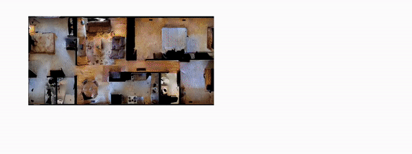

## Image-based Localization

Try image-based localization with the trained model in this demo notebook!
- [Demo] 2. Image-based Localization.ipynb

First, you need to build an RNR-Map for the target environment.
Then, you can query an image to find a location in the RNR-Map.

The query image can be sampled from seen observations, or unseen observations from environment.

### Localize Seen observations

Run the cell named "Localize seen images."

The query image will be given to RNR-Map in order, and the RNR-map-based localization framework predicts the pose of the query image.
Then, we take a picture from the predicted pose in the simulator (named as "localized image") and compare it with the query image.

The visualization window will show the query image, localized image, pose comparison on RNR-Map, and localization probabilities.
In the pose comparison image, the red is the ground-truth pose, and the blue is the predicted pose.

### Unseen observations
> Note that RNR-Map only contains information of the observed regions. 
RNR-Map can localize the novel view from the **observed** region. 
> 
> If the observation is sampled from unobserved region, it can only roughly predict where the place would be. 
> If you want to localize completely unseen observation from the environments, try image-goal navigation demo instead.

Run the cell name "Localize images from unseen view."

In this cell, we perturb the original trajectory with noises to make unseen view poses and re-take the query picture from the simulator.
The query images are taken from the unseen view, and RNR-Map has not observed the same image during the mapping phase.
The examples of localization from an unseen view are shown in the following:

