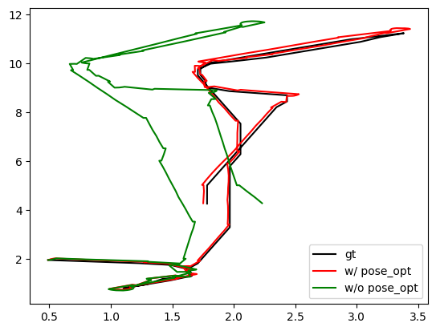

## Camera Tracking
- [Demo] 3. Camera Tracking.ipynb

Try pose adjustment using RNR-Map!

As the rendering process of RNR-Map is differentiable, you can optimize the camera pose using gradient descent.
In this notebook, we will show how to optimize the camera pose using RNR-Map.

First, load pretrained models and setup a random habitat environment.

Then, we will randomly sample start position and navigate to random goal position.
While navigating, we measure odometry and add sensor noises (from [Active Neural SLAM](https://github.com/devendrachaplot/Neural-SLAM)).
The estimated poses will start to be deviated from the ground-truth poses, and the objective of this demo is to find the gt pose using RNR-Map.

In the demo notebook, 'gt_loc' refers to the ground-truth robot pose without any noises, 'bias_loc' refers to the biased robot pose because of the noises,
and 'pred_loc' (or 'curr_loc') is the optimized pose using RNR-Map.

As the rendering process of RNR-Map is differentiable, we can optimize 'pred_loc' by comparing the rendered pixels from pred_loc and observed images.

The visualization window will show the three trajectories and observation images.
In the following, the black trajectory is ground-truth, the green one is biased trajectory without optimization, and the red one is the optimized one.

At every optimization step, we only render 200 random pixels for speed. In our setting, a single time step (including pose optimization + visualization + mapping) takes approximately 0.2 secs. 

After an episode, you can check the whole trajectories by plotting them as following:

